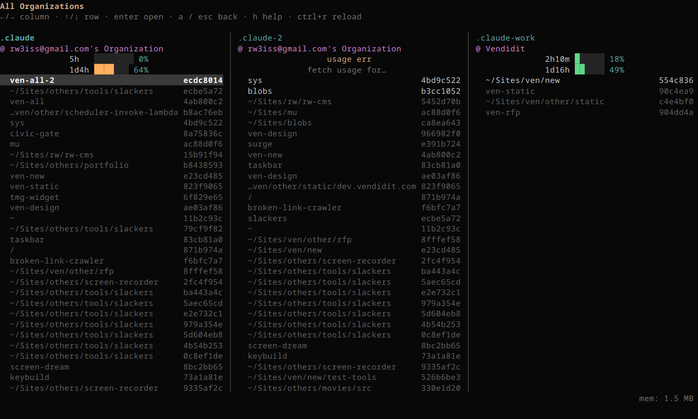
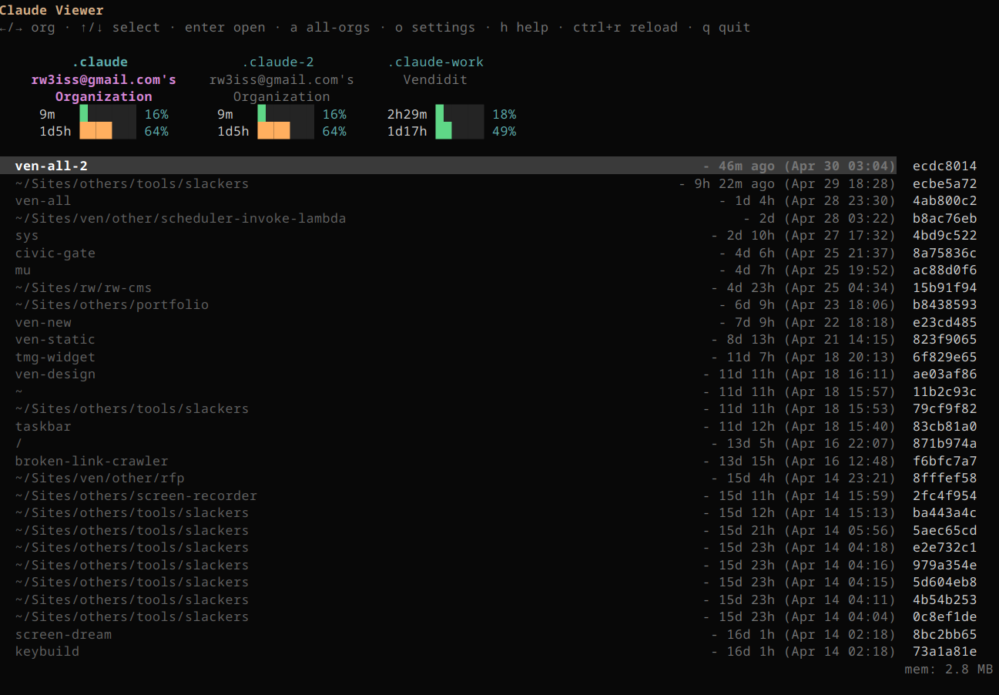
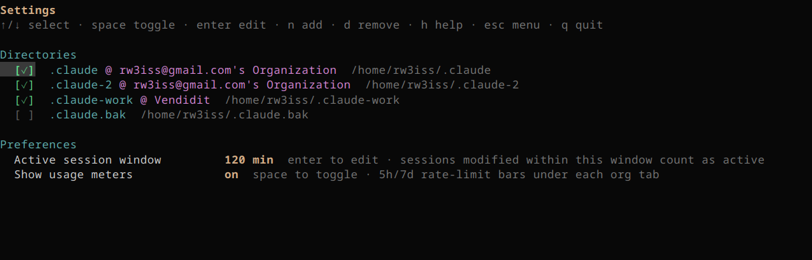
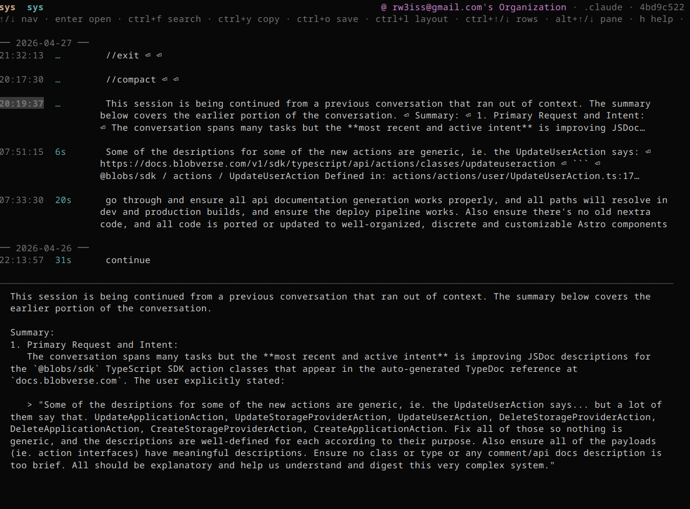
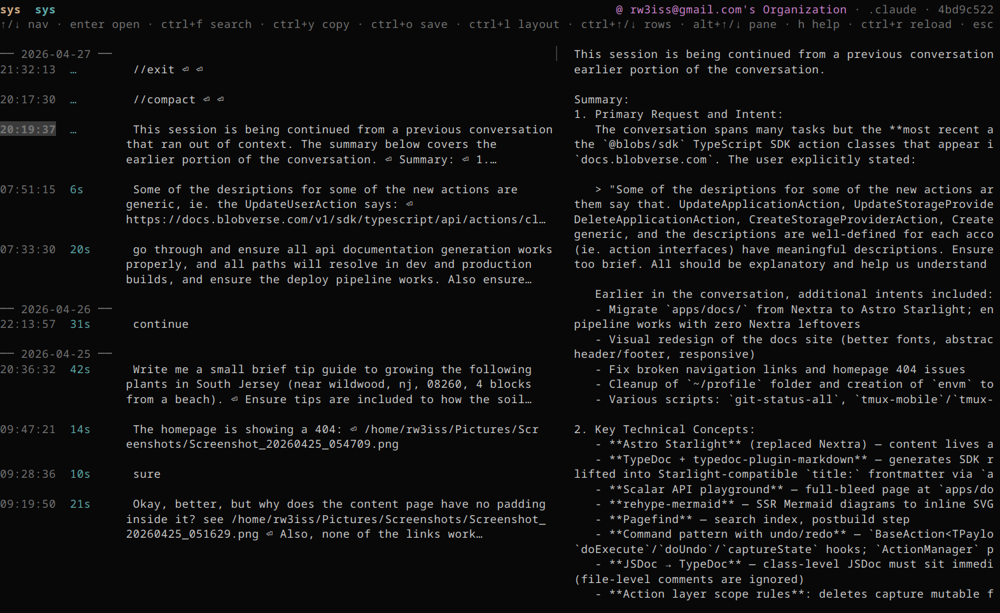

# claude-viewer

A fast, multi-org TUI browser for Claude Code session history — with
**live updates**.

Auto-detects every `~/.claude*` config dir on your machine, lets you page
through their sessions across orgs, and drops you straight into the right
session when you launch from inside a project directory.

**Live-viewing**: every chat session you open is watched via `fsnotify`, so
new prompts and responses appear in the list as Claude writes them — no
key press needed. The main menu shows actually-running sessions (a live
process holds the JSONL open) with a green ●&nbsp;at the top of each org's
list, so you can see at a glance which agents are working *right now*
across every account. Optional 5h/7d usage meters under each org tab
update on reload (`ctrl+r`) so you know how much rate-limit budget each
account has left. Open prompts show per-turn **token usage** (input,
output, cache hits) and time-to-first-response.

It's effectively a multi-window dashboard for everything Claude is doing
on your machine — useful when you have several sessions running in
different terminals, or different accounts, and want to keep tabs on all
of them from one place.

<table>
<tr>
    <td colspan="2" align="center">
     <a href=".github/screenshot_main_orgs.png">
        
      </a><br/>
      <sub><b>All Organizations</b> — every <code>~/.claude*</code> dir rendered as a side-by-side column. <code>←/→</code> moves focus between columns, <code>↑/↓</code> within. Live mem footer in the bottom-right.</sub>
    </td>
  </tr>
  <tr>
    <td width="50%" align="center">
	   <a href=".github/screenshot-session-list.png">
        
      </a><br/>
      <sub><b>Main menu</b> — paged org tabs with 5h/7d usage meters, running sessions ●&nbsp;at top, last-active column.</sub>
    </td>
    <td width="50%" align="center">
      <a href=".github/screenshot_settings.png">
        
      </a><br/>
      <sub><b>Settings</b> — toggle/disable any <code>~/.claude*</code> dir, add custom dirs, edit preferences (active-session window, usage meters).</sub>
    </td>
  </tr>
  <tr>
    <td width="50%" align="center">
      <a href=".github/screenshot_session_vertical.png">
        
      </a><br/>
      <sub><b>Session chat — vertical layout</b> — prompt list on top, full prompt content wrapped below. Toggle with <code>ctrl+l</code>.</sub>
    </td>
    <td width="50%" align="center">
      <a href=".github/screenshot_session_horizontal.png">
        
      </a><br/>
      <sub><b>Session chat — horizontal layout</b> — prompt list on the left, preview pane on the right. Resize with <code>alt+↑/↓</code>.</sub>
    </td>
  </tr>

</table>

## Install

**One-line (any OS with Go 1.22+):**
```sh
curl -fsSL https://raw.githubusercontent.com/rw3iss/claude-viewer/main/scripts/install.sh | bash
```

**From a clone:**
```sh
git clone https://github.com/rw3iss/claude-viewer ~/Sites/tools/claude-viewer
cd ~/Sites/tools/claude-viewer
./scripts/install.sh
```

The installer asks if you want a `cv` alias added to your shell rc. Decline
and it prints the line to add manually.

## Update

```sh
claude-viewer update
```

The update command tries strategies in order:

1. **Local git checkout** — if one is found at `$CLAUDE_VIEWER_SRC`, or
   `~/Sites/tools/claude-viewer`, `~/src/claude-viewer`, `~/code/claude-viewer`,
   `~/Code/claude-viewer`, `~/dev/claude-viewer`, or `~/projects/claude-viewer`,
   it runs `git pull --ff-only && make install` there. Uses whatever git auth
   you already have (typically SSH), so no GitHub token needed.
2. **`go install`** — falls back to `go install github.com/rw3iss/claude-viewer/cmd/claude-viewer@latest`.
   For public repos this just works via the Go module proxy. For private repos
   you need:
   ```sh
   export GOPRIVATE=github.com/rw3iss/*
   git config --global url."git@github.com:".insteadOf "https://github.com/"
   ```
3. **Manual** — if Go isn't installed and there's no checkout, the command
   prints the installer one-liner.

For binary-only users (no Go toolchain), re-run the installer:
```sh
curl -fsSL https://raw.githubusercontent.com/rw3iss/claude-viewer/main/scripts/install.sh | bash
```

## Uninstall

```sh
claude-viewer uninstall
# or
~/Sites/tools/claude-viewer/scripts/uninstall.sh
```

Removes the binary and any `cv` alias block previously added.

## Usage

```sh
claude-viewer            # auto-open the session matching $PWD; menu otherwise
claude-viewer --no-auto  # always show the menu
claude-viewer --dir /path/to/project   # open the session matching that dir
claude-viewer help       # subcommands
cv                       # alias for `claude-viewer`
```

### Screens

| Screen        | Enter via   | What it shows                                              |
| ------------- | ----------- | ---------------------------------------------------------- |
| **Menu**      | (default)   | Sessions for one config dir; `←/→` cycles through dirs.    |
| **All Orgs**  | `a`         | Every enabled dir as a side-by-side column.                |
| **Settings**  | `o`         | Enable/disable detected dirs, add custom paths.            |
| **Chat**      | `enter`     | Session prompts (newest first) + full content preview.    |

### Keys (chat screen)

| Key            | Action                                  |
| -------------- | --------------------------------------- |
| `↑/↓`          | navigate prompts                        |
| `pgup/pgdn`    | jump 10                                 |
| `home/end`     | first/last                              |
| `ctrl+f` / `/` | toggle search filter                    |
| `ctrl+y`       | copy highlighted prompt to clipboard    |
| `ctrl+o`       | save highlighted prompt to `$CWD/...`   |
| `ctrl+l`       | toggle bottom ↔ right preview layout    |
| `ctrl+↑/↓`     | wrap rows per prompt (1–8)              |
| `alt+↑/↓`      | grow/shrink the preview pane            |
| `ctrl+r`       | reload from disk                        |
| `esc`          | back to menu                            |
| `q`            | quit                                    |

Live-reload via `fsnotify` is automatic — new prompts appear within ~300ms.

## Debug mode

```sh
claude-viewer --debug         # verbose logging to stderr + log file
cv --debug --no-auto          # same with the alias
```

When `--debug` is set, the program writes timestamped, file:line-tagged log
entries to **both stderr and** `$XDG_CACHE_HOME/claude-viewer/debug.log`
(typically `~/.cache/claude-viewer/debug.log` on Linux,
`~/Library/Caches/claude-viewer/debug.log` on macOS,
`%LocalAppData%\claude-viewer\debug.log` on Windows).

What gets logged:

- Startup section: version, Go runtime, OS/arch, argv, parsed flags, resolved cwd
- Config: file path + every loaded value (theme, layout, custom dirs, etc.)
- Repo: cache root, every detected `.claude*` dir with org name + custom/disabled flags
- Cwd lookup: which sessions were scanned and which (if any) matched
- Cache: HIT/MISS for every Sessions(...) call with dir + age + count
- Session loading: per-dir count + parse time
- Chat screen: prompt count + load time
- tea program lifecycle markers (`tea program`, `clean exit`)
- Panics: full stack trace + the location where it was caught (`main`, etc.)

The TUI's alt-screen hides stderr while running; tail the log file in
another terminal to watch in real time:

```sh
tail -F ~/.cache/claude-viewer/debug.log
```

If `claude-viewer` panics, the stack trace + location is dumped to both
stderr and the log file before the terminal restores. Re-running with
`--debug` keeps the previous trace appended at the top of the log.

## Multi-org behavior

claude-viewer scans `~/.claude*/projects/` automatically. Each detected dir
is one "page" in the menu (←/→ cycles). The settings screen lets you:

- toggle individual dirs on/off (`space`)
- add a custom dir not under `~/.claude*` (`n` — input field)
- remove custom dirs (`d`)

State persists in `$XDG_CONFIG_HOME/claude-viewer/config.toml`.

## Caching

Session lists per dir are cached at `$XDG_CACHE_HOME/claude-viewer/sessions-*.json`
(short TTL — 5s). The first paint after launch comes from cache; the
background re-scan replaces it when ready. Clear with:

```sh
claude-viewer reset-cache
```

<details>
<summary><b>Configuration file</b></summary>

```toml
# ~/.config/claude-viewer/config.toml

theme         = "default"
preview_rows  = 2
preview_size  = 60       # %
layout        = "bottom"  # or "right"

# Dirs the user explicitly hid (overrides auto-detect):
disabled = []

# User-added custom dirs (non-default paths):
custom = []

# Header widget toggles:
header_show_name = true   # /rename custom title
header_show_dir  = true   # ~/Sites/...
header_show_org  = true   # @ Org Name
header_show_cfg  = true   # .claude-2 / .claude-work
header_show_uuid = true   # short uuid
```

</details>

<details>
<summary><b>Architecture (for contributors)</b></summary>

See [`docs/ARCHITECTURE.md`](docs/ARCHITECTURE.md). Short version:

- `internal/data` — pure data layer (no UI). Detect dirs, parse JSONL, cache.
- `internal/screens` — one file per screen, each a tea.Model.
- `internal/components` — reusable UI fragments (header, footer, alert, modal, lists).
- `internal/theme` — palette interface; default theme registered in `init()`.
  Drop a new theme in this dir and call `theme.Register()`.
- `internal/keys` — shared keymap.
- `internal/clipboard` — OS-aware copy adapter (xclip / wl-copy / pbcopy / clip.exe).
- `internal/events` — cross-screen `tea.Msg` types (avoids import cycle).
- `internal/app` — root tea.Model that routes between screens.
- `cmd/claude-viewer` — CLI entry + subcommands.

Build / test:
```sh
make build           # bin/claude-viewer
make install         # → ~/.local/bin
make dev             # go run
make test            # go test
make cross           # cross-compile dist/* for linux/macOS/windows
```

</details>

<details>
<summary><b>Cross-platform notes</b></summary>

- **Linux**: clipboard via `xclip` (X11) → falls back to `wl-copy` (Wayland) → `xsel`.
- **macOS**: clipboard via `pbcopy`. Single binary; `brew install` once goreleaser is wired up.
- **Windows**: clipboard via `clip.exe`. Run from any terminal that supports
  ANSI (Windows Terminal, ConEmu, etc.). A `.cmd` launcher could be wrapped
  later — see roadmap.

</details>

<details>
<summary><b>Roadmap</b></summary>

- [ ] goreleaser CI pipeline (Homebrew tap + Scoop bucket)
- [ ] Mouse drag-to-resize the preview divider (bubbletea exposes drag events)
- [ ] Theme switcher UI (currently config-only)
- [ ] Plugin hooks via `[hooks]` table — shell out on session-open/copy/etc
- [ ] macOS .app bundle (`platypus` or AppleScript wrapper)
- [ ] Windows .exe launcher (just opens Windows Terminal pointing at the binary)

</details>

## License

MIT.
